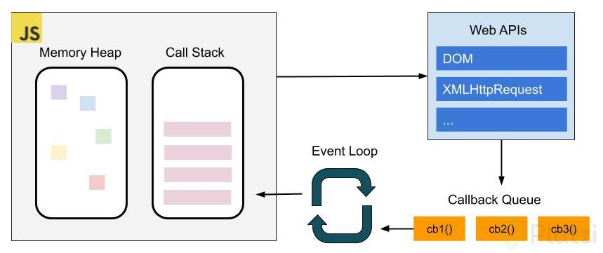

# Asincronismo con JavaScript

## ¿Qué es Asincronismo?
En JavaScript, es un lenguaje de programación asíncrono y no bloqueante que utiliza un manejador de eventos conocido como Event loop implementado en un único hilo para sus interfaces de entrada y de salida. Entonces, asíncronismo es la acción que no ocurre al mismo tiempo.

* **Memory heap:** espacio en memoria compartido para nuestra aplicación.

* **Pila de ejecución (call stack):** Es la pila donde nuestra funciones serán colocadas en orden de ejecución, si una función llama a otra, entonces esta es agregada también a la pila. cuando una función termina su ejecución , sale de la pila.

* **Cola de tareas:** Se espera a que la pila este libre para ejecutar las tareas que tiene.

* **Event loop:** se encarga de entender si la pila de ejecución está vacía para entonces resolver lo que hay en la cola de ejecución.

Al hacer aplicaciones hay que considerar no hacer funciones muy pesadas (que hagan muchos llamados o procesamientos que saturen la pila).

De acuerdo al ejemplo del aeropuerto, quedaria de la siguiente manera:

* **Memory Heap:** Aeropuerto

* **Pila de ejecución:** Pista de aterrizaje/despegue

* **Cola de tareas:** Hangar.

* **Event Loop:** Torre de control.

## Callbacks
### Ventajas
- Simpleza

Nos permite disponer de una sintaxis fácil de entender y comprender qué sucederá al ser
ejecutada.
- Compatibilidad

Los Callbacks son funciones que no necesitan convertir tu código con un polyfill para que
funcionen con todos los navegadores modernos o versiones anteriores.

### Desventajas
Entre las principales desventajas podemos encontrar que disponen de una estructura que puede llegar a ser robusta, más cuando anidamos llamadas a otras funciones, su flujo se puede volver poco intuitivo lo cual nos hará no comprender claramente su estructura.

Manejo de Errores, con los Callbacks no tenemos un camino claro para manejar los errores lo cual se traduce en problemas a la hora de manejar la lógica de nuestro programa.

## Promesas
### Ventajas
- Flujo fluido

Con las promesas podemos manejar un flujo complejos, anidar llamadas y tener una sintaxis clara que nos permite entender nuestro programa o la lógica que implica su uso.
- Manejo de Errores

Las promesas nos proporcionan un forma clara de manejar errores, una sintaxis sencilla y una forma de entender qué sucederá cuando sean ejecutadas.
### Desventajas
- PolyFill

Las promesas no son compatibles con todos los navegadores, si bien los navegadores
modernos pueden interpretar sin problema alguno, navegadores como internet explorer 11
necesitan transpilar el código para que funcionen correctamente.
## Async/Await
### Ventajas
- Sintaxis

Tienen una sintaxis muy simple y clara de leer, lo que nos permite entender de forma muy sencilla su funcionamiento.
- Try/catch

Podemos utilizar try/catch para el manejo de errores con lo cual podemos manejar una
sintaxis clara para el manejo de los errores.
### Desventajas
- Polyfill

Como las promesas, Async/Await aún no tienen toda la compatibilidad con los navegadores
viejos, por lo cual necesitamos transpilar nuestro código para utilizarlos en cualquier
navegador.

## Glosario
Definiciones que debes de tener en cuenta para entender el asincronismo en JavaScript.

* **API**
  * Interfaz de programación de aplicaciones (Application Programming Interface). Es un conjunto de rutinas que provee acceso a funciones de un determinado software.

* **Concurrencia**
  * Cuando dos o más tareas progresan simultáneamente.

* **Paralelismo**
  * Cuando dos o más tareas se ejecutan, literalmente, a la vez, en el mismo instante de tiempo.

* **Bloqueante**
  * Una llamada u operación bloqueante no devuelve el control a nuestra aplicación hasta que se ha completado. Por tanto el thread queda bloqueado en estado de espera.

* **Síncrono**
  * Es frecuente emplear 'bloqueante' y 'síncrono' como sinónimos, dando a entender que toda la operación de entrada/salida se ejecuta de forma secuencial y, por tanto, debemos esperar a que se complete para procesar el resultado.

* **Asíncrono**
  * La finalización de la operación I/O se señaliza más tarde, mediante un mecanismo específico como por ejemplo un callback, una promesa o un evento, lo que hace posible que la respuesta sea procesada en diferido.

* **Call Stack**
  * La pila de llamadas, se encarga de albergar las instrucciones que deben ejecutarse. Nos indica en que punto del programa estamos, por donde vamos.

* **Heap**
  * Región de memoria libre, normalmente de gran tamaño, dedicada al alojamiento dinámico de objetos. Es compartida por todo el programa y controlada por un recolector de basura que se encarga de liberar aquello que no se necesita.

* **Cola o Queue**
  * Cada vez que nuestro programa recibe una notificación del exterior o de otro contexto distinto al de la aplicación, el mensaje se inserta en una cola de mensajes pendientes y se registra su callback correspondiente.

* **Eventloop o Loop de eventos**
  * Cuando la pila de llamadas (call stack) se vacía, es decir, no hay nada más que ejecutar, se procesan los mensajes de la cola. Con cada 'tick' del bucle de eventos, se procesa un nuevo mensaje.

* **Hoisting**
  * Sugiere que las declaraciones de variables y funciones son físicamente movidas al comienzo del código en tiempo de compilación.

* **DOM**
  * DOM permite acceder y manipular las páginas XHTML como si fueran documentos XML. De
hecho, DOM se diseñó originalmente para manipular de forma sencilla los documentos XML.

* **XML**
  * Lenguaje de marcado creado para la transferencia de información, legible tanto para seres humanos como para aplicaciones informáticas, y basado en una sencillez extrema y una rígida sintaxis. Así como el HTML estaba basado y era un subconjunto de SGML, la reformulación del primero bajo la sintaxis de XML dio lugar al XHTML; XHTML es, por tanto, un subconjunto de XML.

* **Events**
  * Comportamientos del usuario que interactúa con una página que pueden detectarse para lanzar una acción, como por ejemplo que el usuario haga click en un elemento (onclick), que elija una opción de un desplegable (onselect), que pase el ratón sobre un objeto (onmouseover), etc.

* **Compilar**
  * Compilar es generar código ejecutable por una máquina, que puede ser física o abstracta como la máquina virtual de Java.

* **Transpilar**
  * Transpilar es generar a partir de código en un lenguaje código en otro lenguaje. Es decir, un programa produce otro programa en otro lenguaje cuyo comportamiento es el mismo que el original.